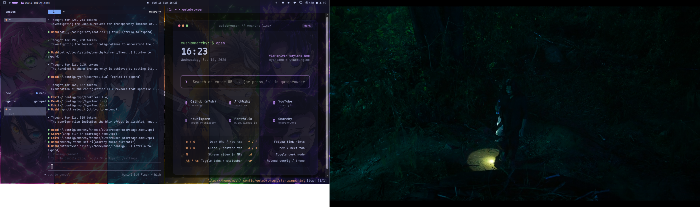

# 🌐 Omarchy Qutebrowser

> **Aesthetic, keyboard-driven Qutebrowser setup with dynamic Omarchy theme synchronization, terminal-matching 0.90 Wayland transparency, and a built-in terminal startpage.**

<p align="center">
  
</p>

<p align="center">
  
  
  
  
</p>

---

## ✨ Features

- 🎨 **Dynamic Omarchy Theme Sync**: Hooks directly into `omarchy theme set <theme>`. Whether you switch to *Velvet Dusk*, *Gruvbox*, *Catppuccin*, or *Everpuccin*, Qutebrowser immediately synchronizes all tab, statusbar, and UI colors via IPC without closing your tabs.
- 🪟 **Crystal-Clear Terminal Transparency**: Matches your `foot` / `ghostty` terminal's exact `0.90` background opacity. No frosted blur distortion — your desktop wallpaper shines through cleanly and sharply.
- ⚡ **Local Terminal Startpage**: A millisecond-fast local new tab dashboard with live system clock, formatted date, DuckDuckGo search bar, bookmark tiles, and a Vim cheat sheet.
- ⌨️ **Vim Keyboard Controls**: Seamless single-key navigation, quick hints, history management, and tab cycling.
- 🎬 **1-Key MPV Video Player**: Press <kbd>M</kbd> on any YouTube or video link (or <kbd>,</kbd><kbd>m</kbd> on any page) to stream directly in hardware-accelerated `mpv`.
- 🌙 **Non-Inverting Dark Mode**: Uses CIELAB lightness curve with smart image protection (`policy.images = "never"`). Toggle on/off anytime with <kbd>t</kbd><kbd>d</kbd>.

---

## 🚀 Quick Install (1-Line Command)

Run this single command in your terminal:

```bash
git clone https://github.com/m7sh/omarchy-qutebrowser.git /tmp/omarchy-qutebrowser && /tmp/omarchy-qutebrowser/install.sh && rm -rf /tmp/omarchy-qutebrowser
```

Or clone and run the installer manually:

```bash
git clone https://github.com/m7sh/omarchy-qutebrowser.git
cd omarchy-qutebrowser
./install.sh
```

### What the installer does:
1. Installs `qutebrowser` (via `omarchy pkg add` or `pacman` if not already installed).
2. Deploys `config.py` to `~/.config/qutebrowser/config.py` (backs up existing config).
3. Installs dynamic templates to `~/.config/omarchy/themed/`.
4. Installs the automated `theme-set.d` hook to `~/.config/omarchy/hooks/theme-set.d/`.
5. Adds the `0.90` window opacity rule to `~/.config/hypr/hyprland.lua`.
6. Generates the active palette for your current Omarchy theme immediately.

---

## 🛠️ Manual Installation

If you prefer to configure manually:

### 1. Copy Qutebrowser Config
```bash
mkdir -p ~/.config/qutebrowser
cp config.py ~/.config/qutebrowser/config.py
```

### 2. Copy Omarchy Theming Templates & Hook
```bash
mkdir -p ~/.config/omarchy/themed ~/.config/omarchy/hooks/theme-set.d
cp contrib/omarchy/qutebrowser-theme.py.tpl ~/.config/omarchy/themed/
cp contrib/omarchy/qutebrowser-startpage.html.tpl ~/.config/omarchy/themed/
cp contrib/omarchy/qutebrowser-theme ~/.config/omarchy/hooks/theme-set.d/
chmod +x ~/.config/omarchy/hooks/theme-set.d/qutebrowser-theme
```

### 3. Add Hyprland Window Rule
Add this to `~/.config/hypr/hyprland.lua`:

```lua
-- Qutebrowser window rules: match terminal 0.90 transparency
o.window("([oO]rg\\.[qQ]utebrowser\\.[qQ]utebrowser|[qQ]utebrowser)", {
  tag = "-default-opacity",
  opacity = "0.90 0.85",
})
```

Reload Hyprland:
```bash
hyprctl reload
```

### 4. Apply Your Current Theme
```bash
omarchy theme set "$(omarchy theme current)"
```

---

## ⌨️ Keybindings Reference

| Key | Action | Description |
| :--- | :--- | :--- |
| <kbd>o</kbd> | `:open [url/search]` | Open URL or search in current tab |
| <kbd>O</kbd> | `:open -t [url/search]` | Open URL or search in a new tab |
| <kbd>f</kbd> / <kbd>F</kbd> | `:hint` | Show link hints to jump / open in background |
| <kbd>d</kbd> | `:tab-close` | Close active tab |
| <kbd>u</kbd> | `:undo` | Restore last closed tab |
| <kbd>J</kbd> / <kbd>K</kbd> | `:tab-prev` / `:tab-next` | Switch to previous / next tab |
| <kbd>M</kbd> | `:hint links spawn mpv` | Stream selected link hint directly in MPV |
| <kbd>,</kbd><kbd>m</kbd> | `:spawn mpv {url}` | Stream current webpage video in MPV |
| <kbd>;</kbd><kbd>m</kbd> | `:hint --rapid links` | Rapid multi-video streaming in MPV |
| <kbd>t</kbd><kbd>d</kbd> | `darkmode toggle` | Toggle smart dark mode |
| <kbd>t</kbd><kbd>t</kbd> | `tabs toggle` | Toggle tab bar visibility |
| <kbd>t</kbd><kbd>s</kbd> | `statusbar toggle`| Toggle status bar visibility |
| <kbd>t</kbd><kbd>r</kbd> | `:config-source` | Reload config and active Omarchy theme |
| <kbd>Esc</kbd> | `cancel` | Clear search selection and return to normal mode |

---

## 🔍 Built-in Search Engines

Use quick prefixes with `:open`:

- `:open gh <search>` — Search **GitHub**
- `:open aw <search>` — Search **ArchWiki**
- `:open yt <search>` — Search **YouTube**
- `:open r <subreddit>` — Open **Subreddit** (e.g. `:open r unixporn`)
- `:open g <search>` — Search **Google**
- `:open w <search>` — Search **Wikipedia**
- `:open om <search>` — Search **Omarchy**
- `:open <search>` — Default search with **DuckDuckGo**

---

## 👤 Author

**Mohammed Musharaf (m7sh)**
- GitHub: [@m7sh](https://github.com/m7sh)
- Portfolio: [m7sh.github.io/m7sh/](https://m7sh.github.io/m7sh/)

---

## 📄 License

[MIT License](LICENSE) © 2026 Mohammed Musharaf
